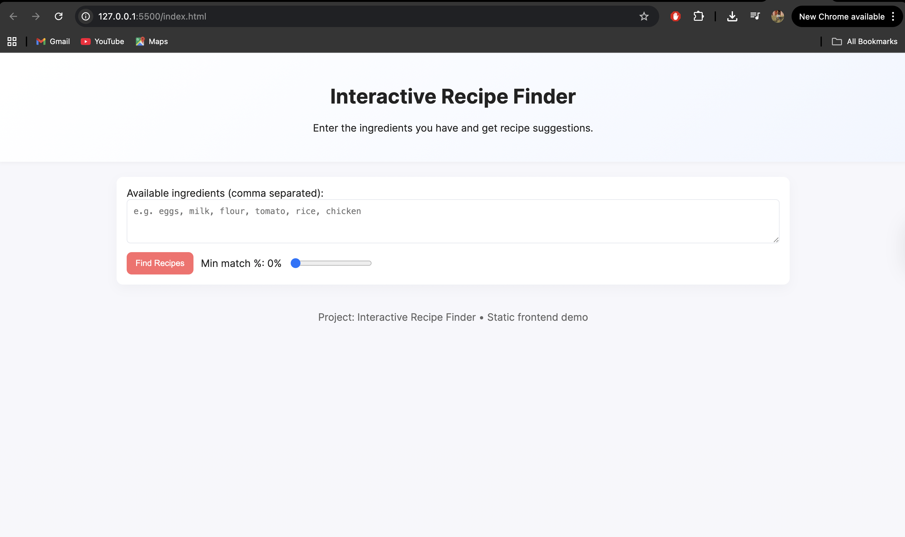

# Interactive-Recipe-Finder
Interactive Recipe Finder: A web application that allows users to search, filter, and explore recipes based on ingredients, cuisine, and dietary preferences. Features include dynamic search results, user-friendly interface, and real-time recipe suggestions, built using HTML, CSS, and JavaScript.
# 🍳 Interactive Recipe Finder

[](https://adarsh9056.github.io/Interactive-Recipe-Finder/)

## Overview

The **Interactive Recipe Finder** is a simple web-based application that helps users discover recipes based on the ingredients they already have at home.  
By entering a list of ingredients, users can instantly get recipe suggestions with a match percentage showing how closely their ingredients fit each recipe.

---

## Screenshot



---

## Features

- **Ingredient-Based Search** – Finds recipes that match your available ingredients.  
- **Adjustable Match Filter** – Use a slider to set the minimum matching percentage.  
- **Responsive Design** – Works smoothly on desktop and mobile devices.  
- **Detailed View** – Displays recipe images, ingredients, and cooking steps in a modal.  
- **Lightweight & Frontend-Only** – No backend or server required; everything runs in the browser.  

---

## Functionality

The application takes user-input ingredients and compares them against the ingredient lists in `recipes.json`.  
It then calculates the percentage of matched ingredients and displays recipes meeting or exceeding the user-defined threshold.

---

## Files

| File | Description |
|------|--------------|
| `index.html` | Main webpage structure |
| `styles.css` | Handles layout, colors, and responsiveness |
| `script.js` | Core logic for recipe matching and modal display |
| `recipes.json` | Dataset containing recipe names, ingredients, and steps |

---

## Technologies Used

- **HTML5** – For structure and layout  
- **CSS3** – For styling and user interface design  
- **JavaScript** – For functionality and interactivity  
- **JSON** – For storing recipe data  

---

## How to Run

1. Clone this repository:  
   ```bash
   git clone https://github.com/adarsh9056/Interactive-Recipe-Finder.git

2. Navigate to the project folder:  
   ```bash
   cd Interactive-Recipe-Finder
   ```

3. Open the `index.html` file in your browser.  
   *(Optional)* You can use a local server like:  
   ```bash
   npx live-server
   ```

---

## Key Results

✅ Successfully filters and recommends recipes based on user ingredients.  
✅ Provides real-time, responsive UI without page reloads.  
✅ Lightweight static frontend suitable for quick deployment or learning projects.  

---

## Future Improvements

- Add recipe search by name or cuisine type  
- Enable saving favorite recipes locally  
- Integrate voice input for ingredients  
- Display nutrition and calorie details  

---

## Contributor

**Adarsh Gupta**

---

## License

This project is licensed under the MIT License – see the [LICENSE](LICENSE) file for details.
